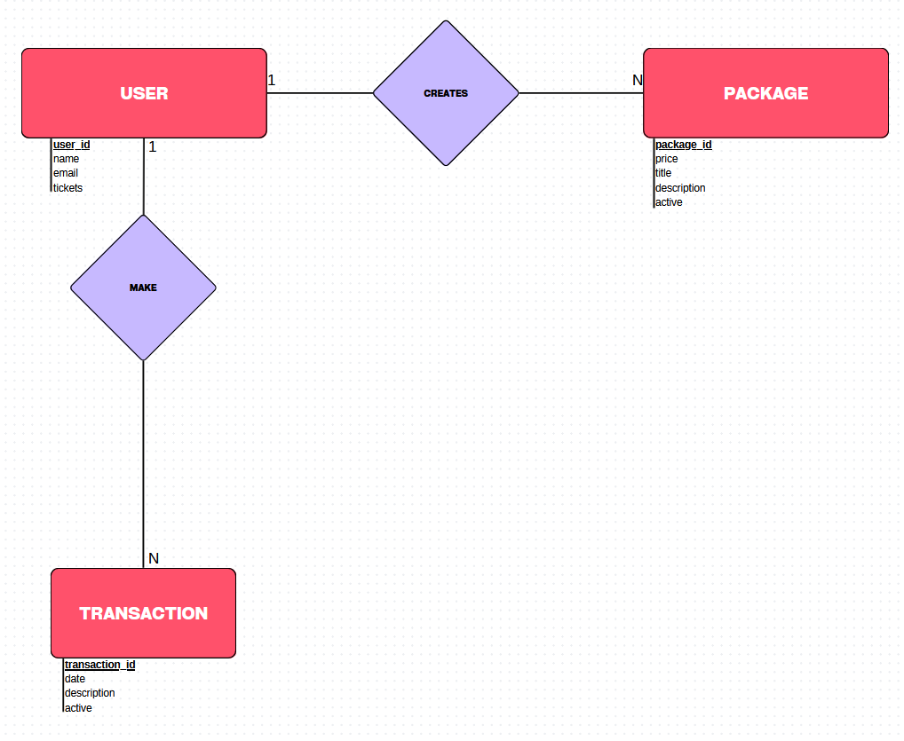

# Padel de Ituzaingo API

API para la gestión del club de pádel desarrollada con FastAPI.

## 🚀 Características

- Gestión de usuarios
- Sistema de tickets
- Paquetes de tickets
- Registro de transacciones
- Autenticación con Firebase
- Roles de usuario (admin/usuario)

## 🔐 Autenticación

La API utiliza Firebase para la autenticación. Todos los endpoints protegidos requieren un token JWT válido en el header:
Authorization: Bearer < token >

## 🗺️ Modelo Entidad Relación



## 📝 Endpoints Principales

### Usuarios

- `GET /user/getUsers` - Obtener todos los usuarios
- `GET /user/getUserById/{user_id}` - Obtener usuario por ID
- `POST /user/createUser` - Crear nuevo usuario
- `PUT /user/addTickets/{user_id}` - Agregar tickets
- `PUT /user/removeTickets/{user_id}` - Remover tickets (admin)

### Paquetes

- `GET /package/getPackages` - Obtener todos los paquetes
- `GET /package/getPackageById/{package_id}` - Obtener paquete por ID
- `POST /package/createPackage` - Crear nuevo paquete
- `PUT /package/updatePackageByID/{package_id}` - Actualizar paquete
- `POST /package/deletePackageByID/{package_id}` - Eliminar paquete

### Transacciones

- `GET /transaction/getTransactions` - Obtener todas las transacciones
- `GET /transaction/getTransactionById/{transaction_id}` - Obtener transacción por ID
- `POST /transaction/createTransaction/{user_id}` - Crear transacción
- `POST /transaction/deleteTransactionById/{transaction_id}` - Eliminar transacción

## 🛠️ Tecnologías Utilizadas

- FastAPI
- SQLAlchemy
- PyMySQL
- Firebase Admin SDK
- Pydantic

## Arquitectura

### 📐 Patrón de Arquitectura

El proyecto utiliza una arquitectura en capas con el patrón Repository, siguiendo los principios SOLID:

```ascii
┌──────────────────┐
│    Controllers   │ → Capa de presentación/API
├──────────────────┤
│    Services      │ → Capa de lógica de negocio
├──────────────────┤
│   Repositories   │ → Capa de acceso a datos
├──────────────────┤
│     Models       │ → Entidades de base de datos
└──────────────────┘
         ↕
┌──────────────────┐
│     Schemas      │ → DTOs/Validación
└──────────────────┘
```

### 📡 Arquitectura API REST

Esta API sigue el modelo RESTful, asegurando una estructura clara y escalable:

- Cada solicitud es independiente y no almacena información del cliente en el servidor
  
- Se accede a los datos mediante URLs organizadas en recursos
  
- Uso de métodos HTTP convencionales (GET, POST, PUT, DELETE)
  
- Se utiliza JSON como formato principal

### 🔍 Descripción de Capas

#### Controller

- Maneja las peticiones HTTP

- Define los endpoints de la API

- Gestiona respuestas HTTP

- No contiene lógica de negocio

- Depende de Services

#### Service

- Contiene la lógica de negicio

- Coordina Repositorios

- Maneja transacciones

- Depende de Repository

#### Repository

- Realiza operaciones CRUD

- Trabaja directamente con los Models

- Abstrae el acceso a datos

#### Model

- Define la estructura de la base de datos

- Define relaciones entre entidades

- Utiliza SQLAlchemy ORM: Mapea las tablas a clases

#### Schema (DTOs)

- Define la estructura de datos para la API

- Valida datos de entrada/salida

- Serializa/deserializa datos

- Separa modelos de la base de datos de modelos de API

#### 🔄 Flujo de Datos

1.Request → Controller

2.Controller → Service (con DTOs)

3.Service → Repository (con Models)

4.Repository → Database

5.Database → Repository

6.Repository → Service

7.Service → Controller (con DTOs)

8.Controller → Response

#### 🔹 Manejo de Errores y Respuestas

- La API utiliza HTTPException de FastAPI para manejar errores y proporcionar respuestas adecuadas a los clientes.
- El manejo de errores se realiza en los Services, donde se verifica si los recursos existen antes de proceder con una operación.
Esto asegura que no ocurran fallos inesperados al realizar operaciones sobre recursos inexistente

### 🎯 Beneficios de esta Arquitectura

#### 📋 Separación de Responsabilidades

- Cada capa tiene una responsabilidad única
- Facilita el mantenimiento

#### 🔄 Independencia de la Base de Datos

- El Patron Repository abstrae el acceso a datos
- Facilita cambiar de base de datos

#### 📈 Escalabilidad

- Fácil agregar nuevas funcionalidades
- Código organizado y mantenible

#### ♻️ Reutilización de Código

- Repositories pueden ser usados por múltiples Services
- DTOs pueden ser reutilizados
